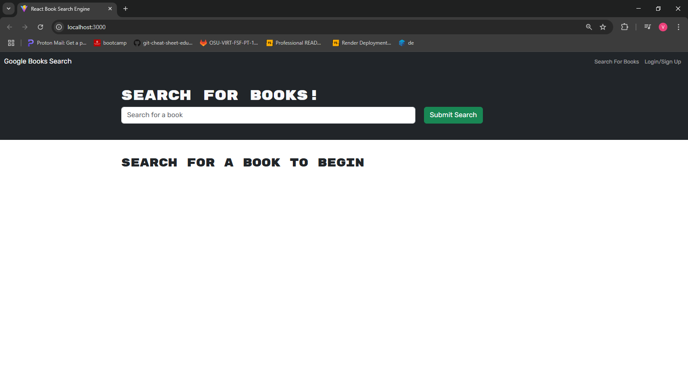
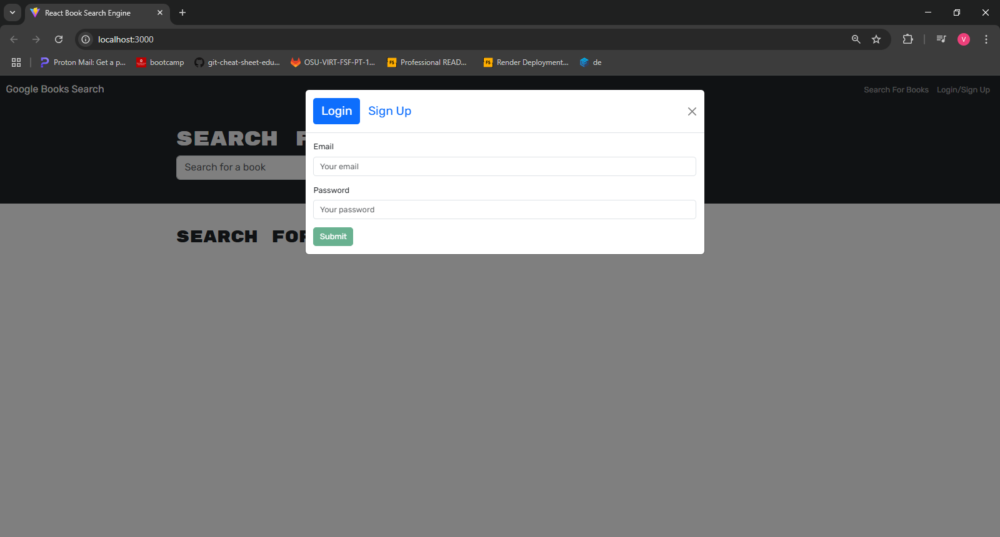
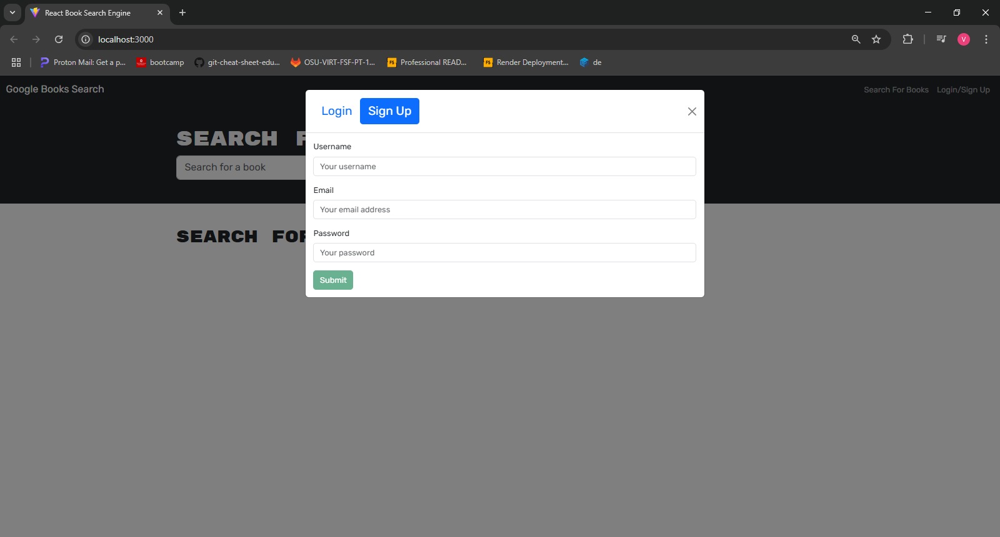
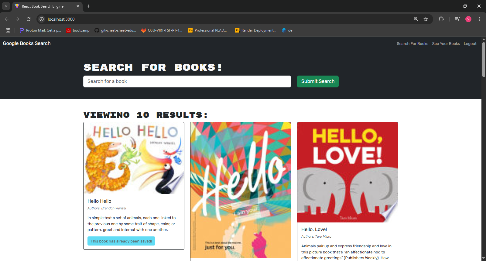
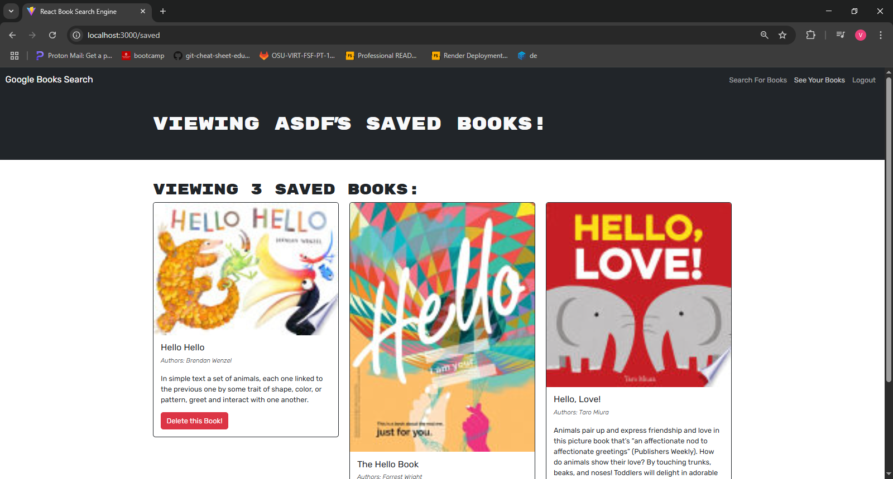

# Book Search

## Description

In this project, we have created a user based Book searching application. In this app, the user can create and login to a profile, search for books listed in the google books api, and save books to be listed under your profiles saved books list.

## Installation

A deployed version of the application can be found at the following url: https://booksearch-t3h4.onrender.com

If the application is to be tested locally, first run "npm i" to install all required dependencies, "npm build" to build the server side of the project, and "npm run develop" to run the project as a vite

## Usage

When first loading the page, the user will be directed to the webpage above. Here the user can search for books, or can click the "Login/Sign Up" button in the top right corner to sign in to their account or create a new account

When clicking the "Login/Sign Up" button, a Model pops up with option to sign in with a created account by entering their account assigned email address and password. If an account hasn't been created, the Sign up button in the model can be selected

When choosing the Sign Up option, the user is given the account creation form, which asks the user to enter a username, an email for the account, and password.

Once signed in, a user can save books to its saved books list by clicking save book button in the bottom left of the populated Book cards. Then to see all books saved in their account, the user can click the "See Your Books" button in the navigation bar

When on the saved books page, the user is shown that they are seeing their saved books. Books can be removed from the list by clicking the "Delete this Book" button in the bottom right corner of the book card.

## Credits

Vijay Natarajan (github.com/santoshalper)